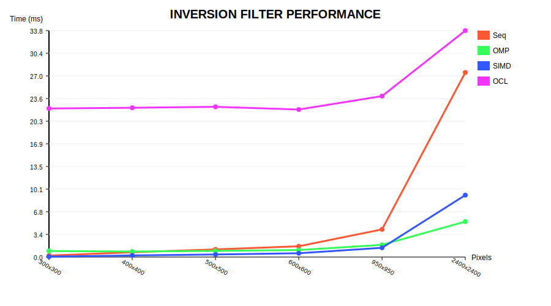
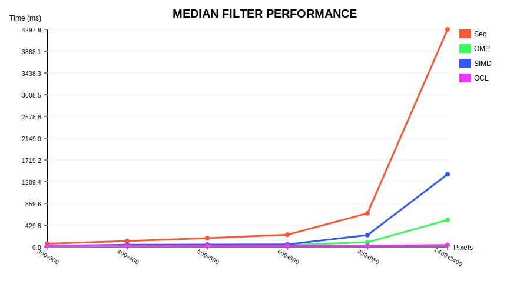
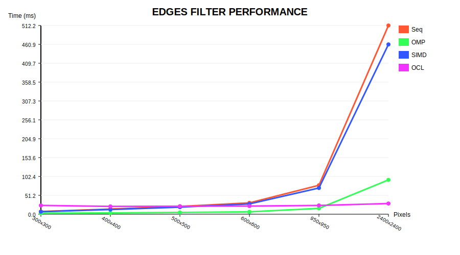

# Лабораторная работа: Параллельные вычисления (M4 Pro)

## 1. Сводная таблица производительности
| Изображение | Фильтр | Метод | Среднее время (ms) |
| :--- | :--- | :--- | :--- |
| 90000 px | inversion | Seq | 0.2172 |
| 90000 px | inversion | OMP | 0.8997 |
| 90000 px | inversion | SIMD | 0.0554 |
| 90000 px | inversion | OCL | 22.1466 |
| 90000 px | median | Seq | 64.1901 |
| 90000 px | median | OMP | 13.1805 |
| 90000 px | median | SIMD | 22.1894 |
| 90000 px | median | OCL | 21.9042 |
| 90000 px | edges | Seq | 7.3396 |
| 90000 px | edges | OMP | 2.8351 |
| 90000 px | edges | SIMD | 6.8357 |
| 90000 px | edges | OCL | 23.8387 |
| 160000 px | inversion | Seq | 0.7165 |
| 160000 px | inversion | OMP | 0.8227 |
| 160000 px | inversion | SIMD | 0.2424 |
| 160000 px | inversion | OCL | 22.2537 |
| 160000 px | median | Seq | 116.6247 |
| 160000 px | median | OMP | 20.0226 |
| 160000 px | median | SIMD | 42.6994 |
| 160000 px | median | OCL | 22.1677 |
| 160000 px | edges | Seq | 14.0023 |
| 160000 px | edges | OMP | 3.5514 |
| 160000 px | edges | SIMD | 12.6596 |
| 160000 px | edges | OCL | 21.1803 |
| 250000 px | inversion | Seq | 1.1411 |
| 250000 px | inversion | OMP | 0.9156 |
| 250000 px | inversion | SIMD | 0.3803 |
| 250000 px | inversion | OCL | 22.3940 |
| 250000 px | median | Seq | 173.8283 |
| 250000 px | median | OMP | 28.0995 |
| 250000 px | median | SIMD | 45.7601 |
| 250000 px | median | OCL | 22.2381 |
| 250000 px | edges | Seq | 21.1292 |
| 250000 px | edges | OMP | 4.8346 |
| 250000 px | edges | SIMD | 19.1209 |
| 250000 px | edges | OCL | 21.5889 |
| 360000 px | inversion | Seq | 1.6076 |
| 360000 px | inversion | OMP | 1.0441 |
| 360000 px | inversion | SIMD | 0.5667 |
| 360000 px | inversion | OCL | 21.9916 |
| 360000 px | median | Seq | 240.9147 |
| 360000 px | median | OMP | 36.5711 |
| 360000 px | median | SIMD | 49.5063 |
| 360000 px | median | OCL | 22.8087 |
| 360000 px | edges | Seq | 30.7749 |
| 360000 px | edges | OMP | 6.5096 |
| 360000 px | edges | SIMD | 27.9681 |
| 360000 px | edges | OCL | 22.0770 |
| 902500 px | inversion | Seq | 4.1202 |
| 902500 px | inversion | OMP | 1.8223 |
| 902500 px | inversion | SIMD | 1.3792 |
| 902500 px | inversion | OCL | 23.9927 |
| 902500 px | median | Seq | 664.4517 |
| 902500 px | median | OMP | 92.2152 |
| 902500 px | median | SIMD | 233.9667 |
| 902500 px | median | OCL | 25.4513 |
| 902500 px | edges | Seq | 78.5577 |
| 902500 px | edges | OMP | 15.8075 |
| 902500 px | edges | SIMD | 71.1267 |
| 902500 px | edges | OCL | 23.7418 |
| 5760000 px | inversion | Seq | 27.5155 |
| 5760000 px | inversion | OMP | 5.2842 |
| 5760000 px | inversion | SIMD | 9.2301 |
| 5760000 px | inversion | OCL | 33.7574 |
| 5760000 px | median | Seq | 4297.9267 |
| 5760000 px | median | OMP | 531.8907 |
| 5760000 px | median | SIMD | 1435.8433 |
| 5760000 px | median | OCL | 38.7149 |
| 5760000 px | edges | Seq | 512.1587 |
| 5760000 px | edges | OMP | 93.1576 |
| 5760000 px | edges | SIMD | 460.8023 |
| 5760000 px | edges | OCL | 28.9831 |

## 2. Графики производительности
### Инверсия

### Медианный фильтр

### Обнаружение границ

## 3. Выводы
- **OpenCL** показывает лучшие результаты на больших данных благодаря разовой инициализации.
- **SIMD** эффективен для простых потоковых операций.
- **OpenMP** обеспечивает стабильное масштабирование на CPU.
